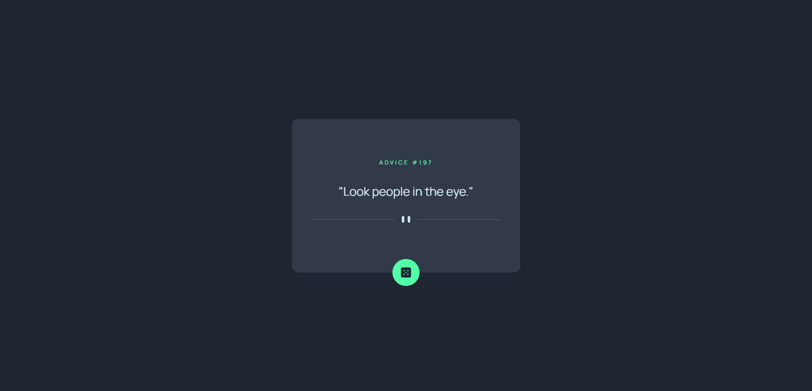
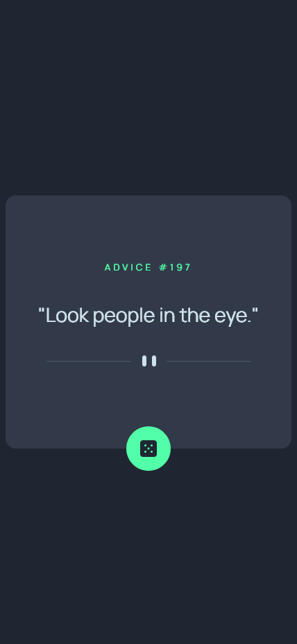

# Frontend Mentor - Advice generator app solution

This is a solution to the [Advice generator app challenge on Frontend Mentor](https://www.frontendmentor.io/challenges/advice-generator-app-QdUG-13db).

### Screenshot

### Desktop

### Mobile

### Links

- Solution URL: [Add solution URL here](https://your-solution-url.com)
- Live Site URL: [Add live site URL here](https://your-live-site-url.com)

## My process

### Built with

- [React](https://reactjs.org/) - JS library
- [Tailwind CSS](https://tailwindcss.com/) - A utility-first CSS framework
- [Vite](https://vitejs.dev/) - Frontend Tooling

## Author

- Frontend Mentor - [@facuagueria](https://www.frontendmentor.io/profile/facuagueria)
- Twitter - [@facundoagueria](https://twitter.com/facundoagueria)

